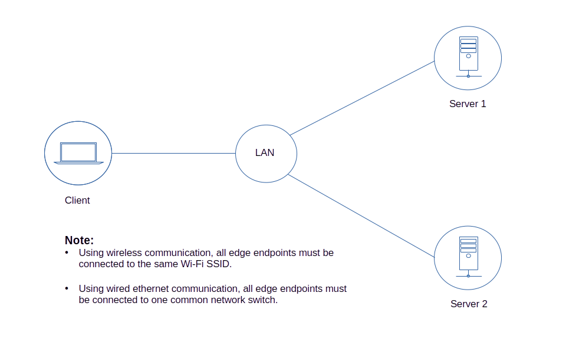

## Edge devices communicating through a private local area network 

<br>

The remote devices must be connected to the internet for authentication ensuring only authorized users can access the edge applications. Users can also configure or edit their edge applications using a browser interface. 

[](assets/m2m-edge.svg)


### Install *m2m* in your edge endpoints.
```js
$ npm install m2m
```
## Edge Server 1 Setup

### 1. Save the code below as server.js in your server 1 project directory.
```js
const m2m = require('m2m')

// simulated voltage data source
function voltageSource(){
  return 50 + Math.floor(Math.random() * 10)
}

let edge = new m2m.Edge()

m2m.connect()
.then(console.log) // success
.then(() => {
  
    let port = 8125		        // must be open if using the endpoint ip
    let host = '127.0.0.1' 	        // using localhost
    //let host = '192.168.0.114' 	// using endpoint ip 
    
    edge.createServer(port, host, (server) => {
    // or   
    //edge.server({port:port, host:host}, (server) => {

      // publish resource
      server.publish('edge-voltage', (tcp) => { // using default 5 secs or 5000 ms polling interval
      // or
      //server.pub('edge-voltage', (tcp) => { 
         let vs = voltageSource()
         tcp.send({port:port, topic:tcp.topic, type:'voltage', value:vs})
      })

      // common client read/write resource
      server.dataSource('/machine-1', (tcp) => { // common resources both for client read and write method 
        let data = { id:tcp.id, rootTopic:tcp.rootTopic, subTopic:tcp.subTopic }
      
        if(tcp.topic === '/machine-1/sensor-1'){
          let rn = Math.floor(Math.random() * 200)
          data.type = 'sensor-1'
          data.value = rn 
        }
        else if(tcp.topic === '/machine-1/sensor-2'){
          let rn = Math.floor(Math.random() * 400)
          data.type = 'sensor-2'
          data.value = rn 
        }
        else if(tcp.topic === '/machine-1' && tcp.payload){
          data.type = tcp.payload.type
          data.value = tcp.payload.value
        }  
        tcp.send(data)
      })
    })
})
.catch(console.log)
```
### 2. Start your application.
```js
$ node server.js
```

## Edge Server 2 Setup

### 1. Save the code below as server.js in your server 2 project directory.
```js
const m2m = require('m2m')

// simulated temperature data source
function tempSource(){
  return 20 + Math.floor(Math.random() * 4)
}

let edge = new m2m.Edge()

m2m.connect()
.then(console.log) // success
.then(() => {
   
    let port = 8126		        // must be open if using the endpoint ip
    let host = '127.0.0.1' 	        // using localhost
    //let host = '192.168.0.115' 	// using endpoint ip
        
    let server = edge.server({port:port, host:host})
    // or
    //let server = edge.createServer(port, host)
    
    // publish resource
    server.pub('edge-temperature', (tcp) => {
      let ts = tempSource()
      tcp.polling = 10000	// set polling interval to 10000 ms or 10 secs instead of the default 5000 ms
      tcp.send({port:port, topic:tcp.topic, type:'temperature', value:ts})
    })

    // http get resource
    server.get('/update-server-data/:id/new-data/:data', (req, res) => {
      res.send({id:res.id, query:req.query, params:req.params})
    })

    // http get resource
    server.get('/device-state', (req, res) => {
      res.send({id:res.id, path:res.path, query:req.query, params:req.params, state:'off'})
    })

    // http post resource
    server.post('/machine-control/:id/actuator/:number/action/:state', (req, res) => {
      res.send({id:res.id, path:res.path, query:req.query, params:req.params})
    })   
})
.catch(console.log)
```
### 2. Start your application.
```js
$ node server.js
```

## Edge Client Setup

### 1. Save the code below as client.js in your client project directory.
```js
const m2m = require('m2m') 

let edge = new m2m.Edge()

m2m.connect()
.then(console.log) // success
.then(() => {
    // edge client 1 
    let ec1 = new edge.client(8125) // access server using localhost
    // or
    //let ec1 = new edge.client({port:8125, ip:'192.168.0.114'}) // access server using its endpoint ip

    ec1.subscribe('edge-voltage', (data) => {
    // or
    // ec1.sub('edge-voltage', (data) => {
      console.log('edge server 1 edge-voltage', data)
    })

    ec1.read('/machine-1/sensor-1')
    .then(console.log)

    ec1.read('/machine-1/sensor-2')
    .then(console.log)

    ec1.write('/machine-1', {type:'root topic', value:350})
    .then(console.log)

    // unsubscribe
    setTimeout(() => {
      ec1.unsub('edge-voltage')
      .then(result => console.log(result.toString()))
    }, 30000)
})
.then(() => {
  // edge client 2
  let ec2 = new edge.client({port:8126}) 
  // or
  //let ec2 = new edge.client(8126, '192.168.0.115') 
  
  ec2.subscribe('edge-temperature', (data) => {
    console.log('edge server 2 edge-temperature', data)
  })

  ec2.get('/update-server-data/320/new-data/'+JSON.stringify({pet:'cat', name:'Captain'})+'?name=Rv')
  .then(console.log)
  
  ec2.post('/machine-control/150/actuator/5/action/on?name=Ed', {id:200, state:'true'})
  .then(console.log)

  // unsubscribe
  setTimeout(() => {
    ec2.unsub('edge-temperature')
    .then(result => console.log(result.toString()))
  }, 60000)
})
.catch(console.log)
```
### 2. Start your application.
```js
$ node client.js
```

### The expected output should be similar as shown below.
```js
$
success
{ subTopic: '/sensor-1', type: 'sensor-1', value: 168 }
{ subTopic: '/sensor-2', type: 'sensor-2', value: 2 }
{
  rootTopic: '/machine-1',
  subTopic: '',
  type: 'root topic',
  value: 350
}
{
  query: { name: 'Rv' },
  params: { id: '320', data: '{"pet":"cat","name":"Captain"}' }
}
{
  path: '/machine-control/150/actuator/5/action/on?name=Ed',
  query: { name: 'Ed' },
  params: { id: '150', number: '5', state: 'on' }
}
...
edge server 1 edge-voltage { port: 8125, topic: 'edge-voltage', type: 'voltage', value: 59 }
true
...
edge server 2 edge-temperature {
  port: 8126,
  topic: 'edge-temperature',
  type: 'temperature',
  value: 21
}
true
```


